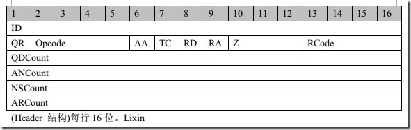
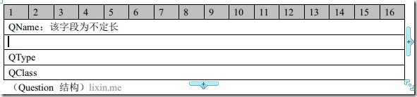
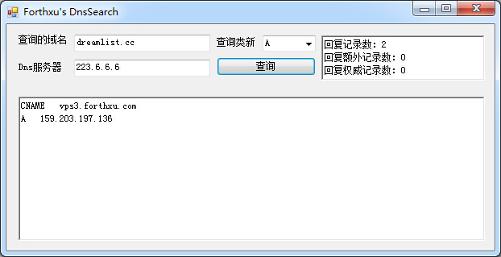

# mydns

dns查询器,主要用来学习dns协议和c#软件开发。

每当我们在浏览器上敲入任何一个域名访问某个网站的时候，我们都要使用Dns协议进行一次”域名:IP”的查询;作为命令行使用者，与dns有关用的最多的就是Nslookup 命令吧；作为程序员，以c#程序员为例，要得到一个域名的ip大概也是这么一行“*System.Net.Dns.GetHostByName(string UriHostName)*”。

在这简单使用的背面，很少人会真了解其协议的规则，这也许就是高度封装给程序员带来的一点麻烦吧。下面来了解一下dns协议的内容。

## DNS结构：

整个dns分为5个部分，分别为Header、Question、Answer、Authority、Additional。

其中头部的大小是固定的为12字节。这5个部分不是全部都是必须的，在向服务器发送查询请求的时候，只需要前2个。回复的时候也不一定包含5个（按查询的内容和返回的信息而定）。

## Header 部分：
header头部分是必须的，无论发送查询或者返回结果都需要该部分，且长度一定，为12字节。结果如下图

ID:长度为16位，是一个用户发送查询的时候定义的随机数，当服务器返回结果的时候，返回包的ID与用户发送的一致。

QR:长度1位，值0是请求，1是应答。

Opcode:长度4位，值0是标准查询，1是反向查询，2是服务器状态查询。

AA:长度1位，授权应答(Authoritative Answer) - 这个比特位在应答的时候才有意义，指出给出应答的服务器是查询域名的授权解析服务器。

TC:长度1位，截断(TrunCation) - 用来指出报文比允许的长度还要长，导致被截断。

RD:长度1位，期望递归(Recursion Desired) - 这个比特位被请求设置，应答的时候使用的相同的值返回。如果设置了RD，就建议域名服务器进行递归解析，递归查询的支持是可选的。

RA:长度1位，支持递归(Recursion Available) - 这个比特位在应答中设置或取消，用来代表服务器是否支持递归查询。

Z:长度3位，保留值，值为0.

RCode:长度4位，应答码，类似http的stateCode一样，值0没有错误、1格式错误、2服务器错误、3名字错误、4服务器不支持、5拒绝。

QDCount:长度16位，报文请求段中的问题记录数。

ANCount:长度16位，报文回答段中的回答记录数。

NSCOUNT :长度16位，报文授权段中的授权记录数。

ARCOUNT :长度16位，报文附加段中的附加记录数。

## Question 部分：

这部分的内容是你要查询的内容。也是必须的。

QName：是你要查询的域名，属于不定长字段。他的格式是**可变长度数据格式**，一般为“长度（1字节）+N字节内容（N由前面的长度定义，不超过63，下面可变数据格式有说明）+～～～+长度0。以一个长度单位N为开始，然后连续的N字节为其内容，然后又是一个N2长度的一字节，然后后面又是N2个字节内容，直到遇到长度为0的长度标记。

假设QName字段的内容是 forth.xu ，则字节内容为：

> 05 66 6f 72 74 68 02 78 75 0

第一个字节是长度：5，那么接下来的5个字节都是内容66 6f 72 74 68 ，ascii码转过来是“forth”。然后又是长度2，后面2个字节的内容78 75 字母为xu，然后是长度0，表示结束了。最后还要把两段文字组合起来中间加点号成forth.xu。

QType：长度16位，表示查询类型。取值大概如下：

> 
enum QueryType //查询的资源记录类型。 
{ 
 A=0x01, //指定计算机 IP 地址。 
 NS=0x02, //指定用于命名区域的 DNS 名称服务器。 
MD=0x03, //指定邮件接收站（此类型已经过时了，使用MX代替） 
MF=0x04, //指定邮件中转站（此类型已经过时了，使用MX代替） 
CNAME=0x05, //指定用于别名的规范名称。 
SOA=0x06, //指定用于 DNS 区域的“起始授权机构”。 
MB=0x07, //指定邮箱域名。 
MG=0x08, //指定邮件组成员。 
MR=0x09, //指定邮件重命名域名。 
NULL=0x0A, //指定空的资源记。 
WKS=0x0B, //描述已知服务。 
PTR=0x0C, //如果查询是 IP 地址，则指定计算机名；否则指定指向其它信息的指针。 
HINFO=0x0D, //指定计算机 CPU 以及操作系统类型。 
MINFO=0x0E, //指定邮箱或邮件列表信息。 
MX=0x0F, //指定邮件交换器。 
TXT=0x10, //指定文本信息。 
UINFO=0x64, //指定用户信息。 
UID=0x65, //指定用户标识符。 
GID=0x66, //指定组名的组标识符。 
ANY=0xFF //指定所有数据类型。 
};

QClass:长度为16位，表示分类。
> 
enum QueryClass //指定信息的协议组。 
{ 
IN=0x01, //指定 Internet 类别。 
CSNET=0x02, //指定 CSNET 类别。（已过时） 
CHAOS=0x03, //指定 Chaos 类别。 
HESIOD=0x04,//指定 MIT Athena Hesiod 类别。 
ANY=0xFF //指定任何以前列出的通配符。 
};

## Answer、Authority、Additional：

接下来的3个结构，格式可以说相同。都是如下图的结构和字段。

Name:回复查询的域名，不定长。 这里的名字和Question结构的名字是一样的，但是为了节省资源，在question结构是这样，在之后的结构中，如果name字段的内容前面有出现了，那么他就不会再浪费空间去重复记录，而是指向某个前面出现了name的位置。如：

在question结构中的name字段的内容为forth.xu，即“05 66 6f 72 74 68 02 78 75 0”。然后在第3个结构中的answer中，第一个字段name的内容也是forth.xu，那么他会指向question中的name地址，让我们去那个地址读name内容。所以此时answer结构的name字段的内容为：

> C0 0C

C0：这时不是表示接下来的内容有多长，而是接下来的内容在偏移量中，

0C:十进制是12的意思，就是偏移12个字节。从头开始12位，因为Header结构是固定的12字节，所以偏移0C就是到了Question的Name字段，即上面的“05 66 6f 72 74 68 02 78 75 0”。

Type：同上QType。

Class：同上QClass。

TTL：生存时间。4字节，指示RDATA中的资源记录在缓存的生存时间。

RDLength:资源的长度。

RDdata：资源的内容。

## 可变长度数据格式 说明：

可变长度有两种内容格式：

**长度方式：**

1字节长度N + N字节内容 [+ 1字节长度N + N字节内容] + 0x00
N最多不超过63也就是2^6，因为最前面两位用来表示地址方式的偏移量。

**地址方式：**

第一字节大于等于0xc0开头，表示指针偏移量，所以偏移量的计算其实并不是指c0后面跟着的一个字节，不然一个字节的偏移量最多只有256个位置。

比如偏移量超过255，是300 ，他的小端格式为0x012c，那么他在内存中的表示应该是这样的：0xc12c。

这个300偏移量应该是这样计算的：

300 = 0x012c(小头) = 00000001 00101100(小头) = 00101100 00000001(大头) = 0x2c01(大头)

0xc0 & 0x2c01(大头) = 11000000 & 00101100 00000001 = 00101100 11000001(大头) = 11000001 00101100(小头) = 0xC12C

也就是：

0xc0 & (((0x012c << 8) & 0xff) & (0x012c >> 8)) = 0xC12C

同理反向计算：

((0xC12C & ~0xc0) & 0xff) << 8 & (0xC12C & ~0xc0) >> 8 = 0x012c = 300

**需要注意是可变长度的格式有3中结尾方式：**

1. 长度+内容+～+长度0
2. 偏移标识+偏移量
3. 长度+内容+～+偏移标识+偏移量

## 现在来说说这个程序了

我按dns协议的结构把项目分成 MyDnsHeader.cs、MyDnsQuestion.cs、MyDnsRecord.cs 这样的3个大结构。

发送dns请求时只需要构造MyDnsHeader和MyDnsQuestion结构，然后通过GetBytes()函数得到构造好的字节数组，然后通过udp发送出去。然后接受来自服务器的响应，将接收到的字节数组通过Parse（byte[] recvData)方法让3个结构去解析，最后通过这些结构的属性字段获取相应的查询信息。

其中的资源记录，目前能分析 A记录、SOA记录、TXT记录、CNAME记录、MX记录、NS记录。

界面截图：

